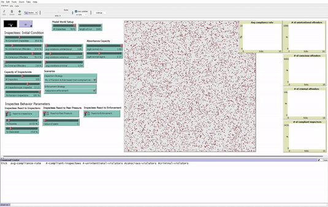

#### To view the model

1. Download [Netlogo](https://ccl.northwestern.edu/netlogo/download.shtml)
2. Download model files into the same folder (the .nlogo and all .nls files)
3. Open the .nlogo file in Netlogo
4. Click the setup button  
    
5. Adjust any parameters using the sliders and switches
6. Click the go button to start the simulation  
    

