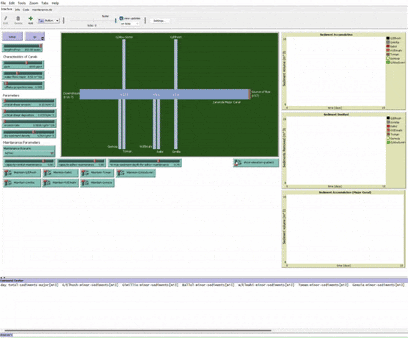

### Understanding Sedimentation Trajectories with Agent-based Modeling of Sudan's Gezira Irrigation Scheme

Meticulously designed in the 1920s, the Gezira Irrigation Scheme in Sudan was seen as a symbol of power and planned development that advanced the British colonial economy. However, by the end of the 20th century, it became a symbol of failed development as its function deteriorated due to sedimentation. Scholars have argued about the causes of sedimentation, claiming that the canals’ deterioration was caused by the transition of maintenance responsibilities from centralized maintenance by the British colonists to ad hoc maintenance by the Sudanese tenants. Without systematic historical measurements, it is hard to validate these claims.
  
I developed an agent-based model incorporating landscape-driven effects, hydrological processes, and sediment deposition to simulate environmental conditions and maintenance strategies over the last century. From the model's results, I draw conclusions on the principle cause of sedimentation in the Gezira canals. 

[See the full report here](https://drive.google.com/file/d/1OiOlzZw2aZiWtdgFCl4wKmkiGQlJg3Gd/view?usp=drive_link) 

 
#### To view the model

1. Download [Netlogo](https://ccl.northwestern.edu/netlogo/download.shtml)
2. Download model files into the same folder (the .nlogo and all .nls files)
3. Open the .nlogo file in Netlogo
4. Click the setup button  
    
5. Adjust any parameters using the sliders and switches
6. Click the go button to start the simulation  
    

